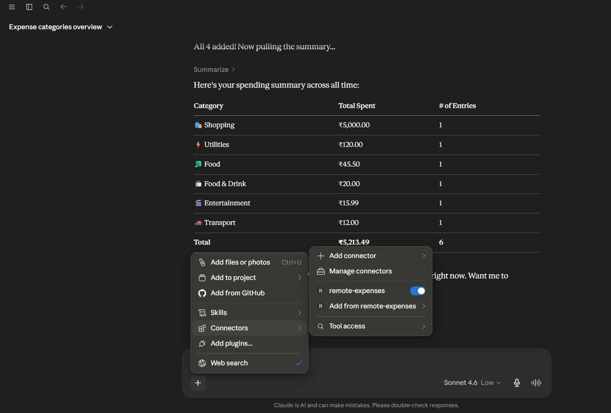

# Remote MCP Server - Expense Tracker
A powerful Model Context Protocol (MCP) server designed to track, categorize, and summarize your expenses directly through your favorite AI assistants (like Claude Desktop and Cursor).


## 🚀 Live Connection Link
Your server is currently hosted and running live on Hugging Face Spaces. You can connect your AI assistant to it immediately using this SSE endpoint:
**Connector Link:** `https://anjanii-remote-mcp-server.hf.space/mcp`
---
## 🔌 How to Connect to Your AI
### For Cursor IDE
1. Open Cursor Settings -> **Features** -> **MCP**.
2. Click **+ Add New MCP Server**.
3. **Type:** Select `SSE`.
4. **Name:** `ExpenseTracker`
5. **URL:** Paste `https://anjanii-remote-mcp-server.hf.space/mcp`
6. Click Save!
### For Claude Desktop
Add this to your `claude_desktop_config.json` to bridge the remote connection using FastMCP:
```json
{
  "mcpServers": {
    "remote-expenses": {
      "command": "uvx",
      "args": [
        "fastmcp",
        "run",
        "https://anjanii-remote-mcp-server.hf.space/mcp"
      ]
    }
  }
}
```
---
## 🛠️ Available Tools
- `add_expense`: Add a new expense (date, amount, category, subcategory, note).
- `list_expenses`: Retrieve a list of expenses between a date range.
- `summarize`: Get an aggregated summary of expenses grouped by category.
---
## 💻 Local Development & Hosting
If you want to run this locally so your SQLite database (`expenses.db`) is saved permanently to your hard drive:
### Using Docker
1. Build the image:
   ```bash
   docker build -t expense-mcp-server .
   ```
2. Run with a persistent volume to save your data:
   ```bash
   docker run -d -p 8000:8000 -v expense-data:/data expense-mcp-server
   ```
### Using Python & FastMCP CLI
1. Activate your virtual environment.
2. Launch the developer UI (MCP Inspector):
   ```bash
   fastmcp dev inspector main.py
   ```
